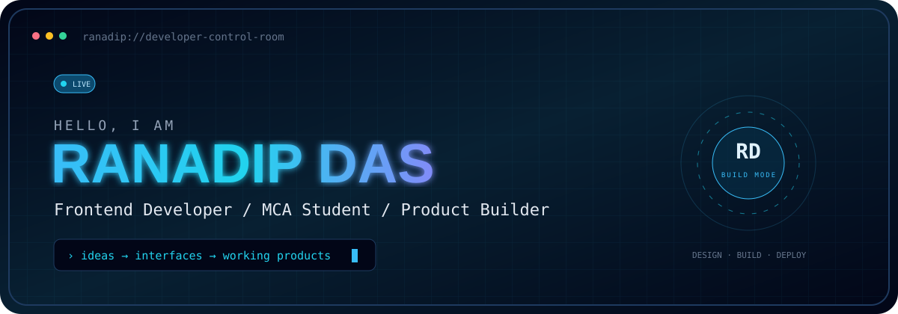
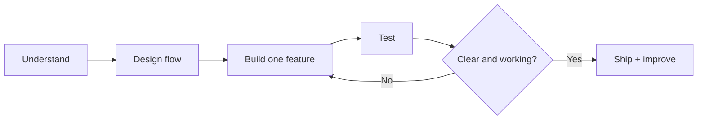

  
    

  
  
  

<table>
<tr>
<td width="58%" valign="top">

## 01 / WHO_I_AM

I am an MCA student building my path into frontend and web development through real, deployed projects.

My focus is simple: turn an idea into a clear interface, connect it with useful logic, test it properly, and improve it until it feels complete.

<pre>
const ranadip = {
  role: "Frontend Developer",
  builds: ["interfaces", "workflows", "web apps"],
  stack: ["React", "JavaScript", "PHP", "MySQL"],
  status: "open to opportunities"
};
</pre>

</td>
<td width="42%" valign="top">

## SYSTEM_STATUS

<pre>
LOCATION       West Bengal, India
EDUCATION      MCA · 2025—2027
PRIMARY MODE   Build → Test → Improve
CURRENT FOCUS  React + JavaScript
AVAILABILITY   Online
</pre>

> I do not add technology just to make a list longer. If it appears here, I have used it or I am actively learning it.

</td>
</tr>
</table>

## 02 / ACTIVE_MISSIONS

<table>
<tr>
<td width="50%" valign="top">

### ◈ SchemaCraft
**Visual Database Designer**

Design tables, define relationships, and generate SQL through a focused visual workflow.

React · JavaScript · CSS · Vite

[**Launch ↗**](https://schema-craft-gamma.vercel.app/) · [**Source ↗**](https://github.com/ranadip-dev/SchemaCraft)

</td>
<td width="50%" valign="top">

### ◈ Developer Portfolio
**My work, presented as a product**

A responsive portfolio that gives recruiters a direct view of my skills, decisions, projects, and case studies.

React · JavaScript · CSS · Vite

[**Launch ↗**](https://ranadip-portfolio.vercel.app/) · [**Source ↗**](https://github.com/ranadip-dev/ranadip-portfolio)

</td>
</tr>
<tr>
<td colspan="2" valign="top">

### ◈ Uraan Travel Agency
**Full-stack booking workflow**

A PHP and MySQL application connecting packages, accounts, bookings, enquiries, user controls, and admin operations.

PHP · MySQL · PDO · JavaScript · CSS

[**View Case Study ↗**](https://ranadip-portfolio.vercel.app/)

</td>
</tr>
</table>

## 03 / ENGINEERING_TOOLKIT

| Interface | Logic | Backend & Data | Workflow |
|:---:|:---:|:---:|:---:|
| HTML5 · CSS3 | JavaScript · React | PHP · MySQL · PDO | Git · GitHub · Vite |
| Responsive UI | Components · State | CRUD · Sessions | Build · Debug · Deploy |

## 04 / BUILD_PROTOCOL

## 05 / SIGNAL_LOG

  
  
  

## 06 / OPEN_CHANNEL

I am looking for frontend, junior web development, and internship opportunities where I can contribute, learn from a real team, and keep building practical products.

[**VIEW MY WORK**](https://ranadip-portfolio.vercel.app/) · [**CONNECT WITH ME**](https://www.linkedin.com/in/ranadip-das-dev/)

CONTROL ROOM ONLINE · BUILT WITH CURIOSITY, CODE AND CONSISTENT IMPROVEMENT

