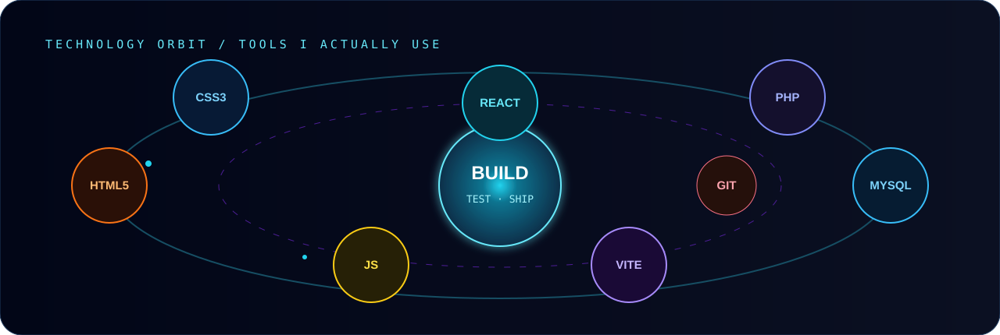

 

 

## Selected builds

<table>
<tr>
<td width="33%" valign="top">

### SchemaCraft

Visual database designer for creating tables, relationships, and SQL through a focused interface.

**React · JavaScript · CSS · Vite**

[Live product](https://schema-craft-gamma.vercel.app/) · [Source](https://github.com/ranadip-dev/SchemaCraft)

</td>
<td width="33%" valign="top">

### Developer Portfolio

A responsive product-style portfolio presenting my skills, development decisions, projects, and case studies.

**React · JavaScript · CSS · Vite**

[Live site](https://ranadip-portfolio.vercel.app/) · [Source](https://github.com/ranadip-dev/ranadip-portfolio)

</td>
<td width="33%" valign="top">

### Uraan Travel Agency

Full-stack travel workflow connecting accounts, packages, bookings, enquiries, user controls, and admin operations.

**PHP · MySQL · PDO · JavaScript**

[View case study](https://ranadip-portfolio.vercel.app/)

</td>
</tr>
</table>

 

### I build one feature at a time, test it properly, and improve what matters.

MCA 2025–2027 · West Bengal, India  
Open to Frontend Developer, Junior Web Developer, and internship opportunities

 

[**ENTER THE PORTFOLIO →**](https://ranadip-portfolio.vercel.app/)

