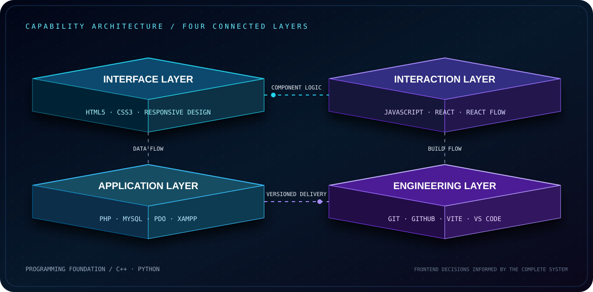
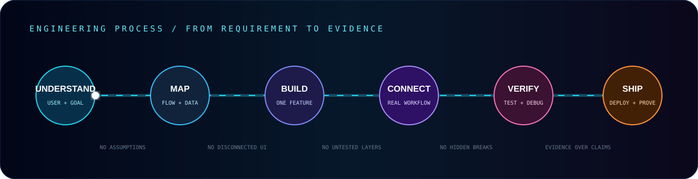
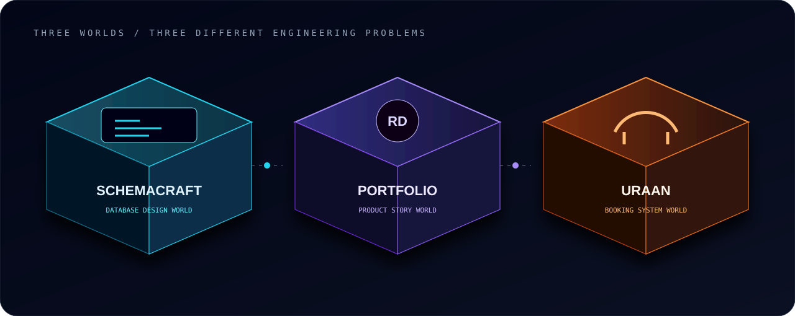

## Front-end Developer. Full-stack capable.

I approach development through the complete application workflow, not only the interface.

My frontend work is supported by hands-on experience with authentication, application logic, relational data, secure database operations, and deployment. This helps me build interfaces that are not separate screens, but working parts of a complete product.

## How I work

I begin with the user flow and data relationships. Then I build one connected feature at a time, test the real workflow, fix weak points, and improve the result without adding complexity that the product does not need.

## Selected engineering work

### 01 · SchemaCraft

**Visual database design through an interactive workspace**

SchemaCraft turns database planning into a visual workflow. Users can create tables, define fields, establish relationships, and generate SQL while seeing the structure take shape.

**What it demonstrates:** component-based interface design, complex state handling, React Flow integration, relationship modelling, SQL generation, responsive layout, and production deployment.

**React · Vite · JavaScript · CSS · React Flow**

[**Live Application ↗**](https://schema-craft-gamma.vercel.app/) · [**Source Code ↗**](https://github.com/ranadip-dev/SchemaCraft) · [**Case Study ↗**](https://ranadip-portfolio.vercel.app/projects/schemacraft)

---

### 02 · Uraan Travel Agency

**A connected customer and administrative booking system**

Uraan connects travel discovery, customer accounts, bookings, enquiries, user controls, and administrative operations through one relational application workflow.

**What it demonstrates:** PHP application structure, MySQL relationships, PDO prepared statements, authentication, sessions, role-based access, CRUD operations, server-side validation, booking management, and deployment.

**PHP · MySQL · PDO · JavaScript · HTML · CSS**

[**Live Application ↗**](https://uraantravel.infinityfreeapp.com/) · [**Source Code ↗**](https://github.com/ranadip-dev/Uraan_travel_agency) · [**Case Study ↗**](https://ranadip-portfolio.vercel.app/projects/uraan)

---

### 03 · Developer Portfolio

**A portfolio designed as a product, not a collection of sections**

The portfolio presents my work through clear positioning, compact project stories, technical case studies, responsive interaction, and direct access to the evidence behind each project.

**What it demonstrates:** React component architecture, responsive interface design, structured content, project storytelling, reusable UI patterns, deployment, and continuous refinement.

**React · Vite · JavaScript · CSS**

[**Live Portfolio ↗**](https://ranadip-portfolio.vercel.app/) · [**Source Code ↗**](https://github.com/ranadip-dev/ranadip-portfolio)

## Engineering principles

<table>
<tr>
<td width="25%" valign="top"><strong>Clarity before decoration</strong>  The interface should make the workflow easier to understand.</td>
<td width="25%" valign="top"><strong>One connected feature at a time</strong>  Each feature is completed and tested before the next layer is added.</td>
<td width="25%" valign="top"><strong>Frontend with system awareness</strong>  UI decisions consider application logic, authentication, and relational data.</td>
<td width="25%" valign="top"><strong>Evidence over claims</strong>  Live products, source code, and case studies show how the work was built.</td>
</tr>
</table>

### The interface is only the visible layer. I build with the complete workflow in mind.

[**PORTFOLIO**](https://ranadip-portfolio.vercel.app/) · [**LINKEDIN**](https://www.linkedin.com/in/ranadip-das-dev/) · [**GITHUB**](https://github.com/ranadip-dev)

